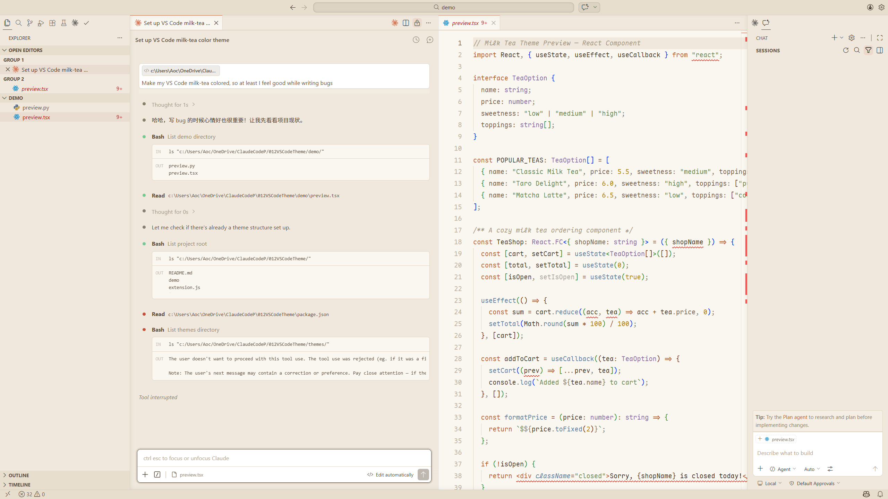
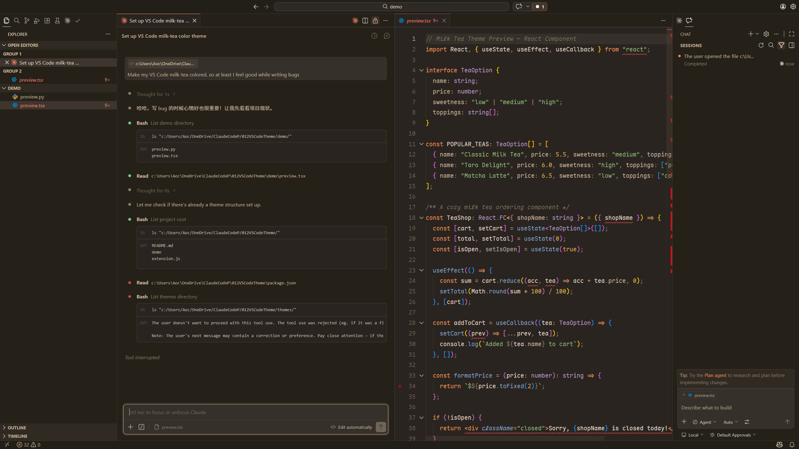

# Milk Tea — Warm & Friendly VS Code Theme

A warm, creamy theme inspired by Claude's desktop palette. Designed to make VS Code feel less intimidating and more welcoming for everyone.

一款温暖的奶茶色 VS Code 主题，灵感来自 Claude 桌面端的配色。让 VS Code 不再冰冷，对新手更友好。

> "Make my VS Code milk-tea colored, so at least I feel good while writing bugs."

## Preview

### Milk Tea Light

### Milk Tea Dark

## Features

### Color Themes

- **Milk Tea Light** — Creamy warm background with soft, readable syntax colors
- **Milk Tea Dark** — Deep brown tones (not pure black), cozy for night coding

### Icon Theme

- **Milk Tea Icons** — Warm-toned file & folder icons that match the theme palette

### One-Click Friendly Settings

Run `Ctrl+Shift+P` → `Milk Tea: 应用推荐设置` to instantly optimize your VS Code:

| Setting | What it does |
|---------|-------------|
| Larger font & line height | Code is easier to read |
| Smooth cursor & scrolling | Everything feels silky |
| Hide minimap & breadcrumbs | Less visual clutter |
| Bracket pair colorization | See code structure at a glance |
| Activity bar on top | More horizontal space |
| Show welcome page | Friendly start screen |

All settings are optional — pick what you like from the checklist.

To revert: `Ctrl+Shift+P` → `Milk Tea: 恢复默认设置`

### Recommended Font

This theme pairs beautifully with [Maple Mono](https://github.com/subframe7536/maple-font) — a rounded, warm monospace font with ligature support and CJK characters.

Download **MapleMono-NF-CN** from the [releases page](https://github.com/subframe7536/maple-font/releases), install the `.ttf` files, and the theme will use it automatically.

> Don't worry if you skip this step — the theme falls back to Consolas gracefully.

## Install

### From VSIX 文件（推荐）

1. 在 [Releases](https://github.com/ArtemisLin/vscode-milk-tea-theme/releases) 页面下载最新的 `.vsix` 文件
2. 打开 VS Code，`Ctrl+Shift+P` → `Extensions: Install from VSIX...`
3. 选择下载的 `.vsix` 文件
4. `Ctrl+Shift+P` → `Color Theme` → **Milk Tea Light** or **Milk Tea Dark**

### From Source

1. Clone this repo
2. `Ctrl+Shift+P` → `Developer: Install Extension from Location...`
3. Select the cloned folder
4. `Ctrl+Shift+P` → `Color Theme` → **Milk Tea Light** or **Milk Tea Dark**

## Color Palette

| Role | Light | Dark |
|------|-------|------|
| Background | `#FAF6F0` | `#2A2420` |
| Foreground | `#3D3029` | `#E8DDD0` |
| Accent | `#D97757` | `#E8945A` |
| Keywords | `#C0602A` | `#E8945A` |
| Strings | `#6A8D55` | `#8DB87A` |
| Functions | `#5B7FA5` | `#82A0C4` |
| Types | `#8B6DA8` | `#B898C0` |
| Constants | `#B8860B` | `#D4A84B` |
| Comments | `#A89880` | `#7A6D5C` |

## Feedback

Issues and suggestions welcome on [GitHub](https://github.com/ArtemisLin/vscode-milk-tea-theme/issues).

## License

MIT
